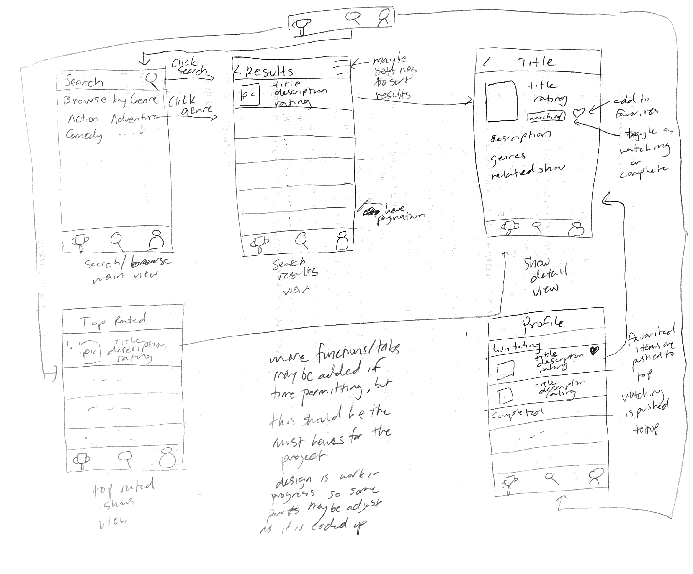

Original App Design Project - README 
===

# AniApp (name tbd)

## Table of Contents

1. [Overview](#Overview)
2. [Product Spec](#Product-Spec)
3. [Wireframes](#Wireframes)
4. [Schema](#Schema)

## Overview

### Description

This app allows users to browse anime to find a show that they find interesting and want to watch. Users can view more detailed information about an anime through a detailed view where they can also favorite or mark a show as watching. All the watching shows will be compiled in a list for the users to easily view with starred shows pushed to the top of the list. Users can also view the top rated anime in a separate page.

### App Evaluation

- **Category:** Entertainment
- **Mobile:** I would not necessarily say that this type of app needs to be mobile. There are indeed many web apps that serve the same purpose, but there are fewer mobile apps. This essentially serves as an alternative for people to use if they would rather use a mobile app.
- **Story:** Users can search for any interesting shows they plan on watching next and can organize their anime list so they easily sort through and find shows.
- **Market:** Any person who has interests in anime and watches it on a regular basis
- **Habit:** Users would typically use this during their free time whenever they plan on watching a show. It is not necessarily something they would be constantly using it, but something they will use when they need it.
- **Scope:** The functionality I wanted to implement should not be too difficult to implement within this timeframe even if I run into other busy assignments. The tasks builds upon what we have learned in the course with using APIs, table views, navigation, etc so it is good project to do for a capstone. It is not too simple nor too complex and if needed more functionality can be added during the development process as well. 

## Product Spec

### 1. User Stories (Required and Optional)

**Required Must-have Stories**

* Have a list of genres users can browse by 
* Entering and searching by a query or clicking on a genre will bring the user to the search result page
* Search result page should show a list of shows in a table view with some brief information about the show (picture, title, description, rating)
* Clicking on a table item will bring the user to a detailed view with more information about the show
* Detailed view will allow users to favorite a show or mark it as watching/complete
* There is a page that allows users to view top rated shows in a table view
* Users should be able to view their watching list and starred list

**Optional Nice-to-have Stories**

* Allow users to adjust the sorting criteria/number of shows shown in each page through settings on search page
* Add all features for manga as well
* Allow users to click on genres on show detail page to go to search page for that genre
* Have a search page that allows users to search for shows with some query
* Search result page should include some pagination
* Users should be able to view their watch list and complete list with favorite shows being pushed towards the top of each respective list

### 2. Screen Archetypes

- [x] Main Search Screen
* ~~Have a search page that allows users to search for shows with some query~~
* Have a list of genres users can browse by
* Entering and searching by a query or clicking on a genre will bring the user to the search result page
- [x] Search Result Screen
* Search result page should show a list of shows in a table view with some brief information about the show (picture, title, description, rating)
* Clicking on a table item will bring the user to a detailed view with more information about the show
- [x] Detailed View
* Detailed view will allow users to favorite a show or mark it as watching/complete
* Includes more detailed information about the show (all the genres, studio, etc)
- [x] Top Rated Screen
* There is a page that allows users to view top rated shows in a table view
- [x] Anime List Screen
* ~~Users should be able to view their watch list and complete list with favorite shows being pushed towards the top of each respective list~~
* Users should be able to view their watching list and starred list

### 3. Navigation

**Tab Navigation** (Tab to Screen)

* Top Rated Shows
* Search/Browse
* Watch/Complete List

**Flow Navigation** (Screen to Screen)

- [ ] Top Rated Shows
* Clicking on show goes to show detailed view
- [ ] Search/Browse
* Clicking on search or a genre goes to search result page
* Clicking show goes to show detailed view
- [ ] Watch/Complete List Screen
* Clicking on show goes to show detailed view

## Wireframes

[Add picture of your hand sketched wireframes in this section]

### [BONUS] Digital Wireframes & Mockups

### [BONUS] Interactive Prototype

## Schema 

[This section will be completed in Unit 9]

### Models

[Add table of models]

### Networking

- [Add list of network requests by screen ]
- [Create basic snippets for each Parse network request]
- [OPTIONAL: List endpoints if using existing API such as Yelp]
